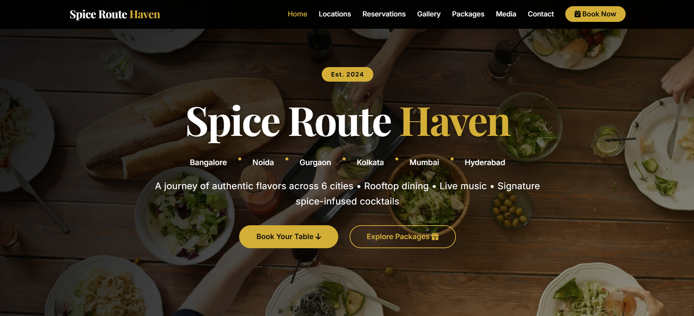
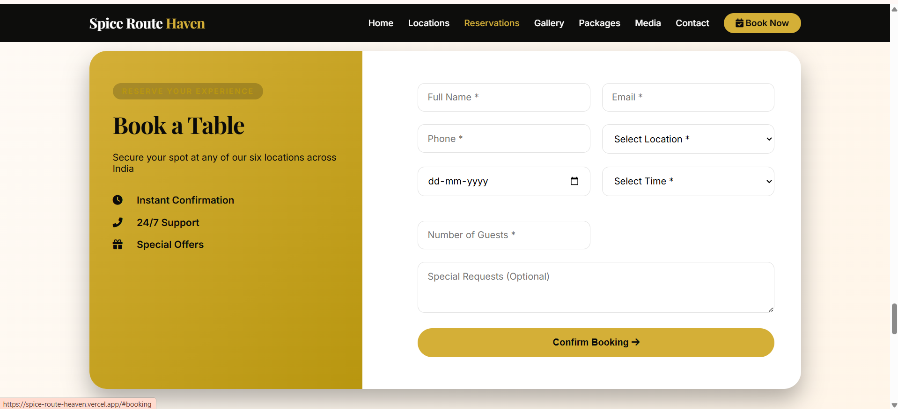

<div align="center">
  
  <h1>Spice Route Heaven</h1>
  <p><i>A Beachside Culinary Journey</i></p>
</div>

<div align="center">

# 🍽️ SPICE ROUTE HAVEN 🍽️

✨ ***Experience the Perfect Blend of Taste and Tradition***🍷

</div>

----

<div align="left">

**Spice Route Haven** is a comprehensive restaurant management platform designed to bridge the gap between customers and restaurant operations. The website features an elegant, responsive interface where users can browse the menu, book tables for lunch or dinner using mobile number authentication, and manage their reservations in real-time. Behind the scenes, an intuitive admin dashboard allows restaurant staff to track bookings, manage availability, and oversee daily operations. Built with a secure backend API, the system ensures data persistence and a smooth user experience across all devices.

</div>

---

## 🚀 Take a Live Tour

Experience Spice Route Haven in real time:  
🌐 https://spice-route-heaven.vercel.app/

---

## 📌 Overview

**Spice Route Haven** is a full-stack restaurant management and customer-interaction platform designed to deliver a seamless dining experience.

It includes:

- 🍛 Restaurant website interface
- 📅 Table booking system
- 📩 Contact management
- 👤 User authentication
- 🛠️ Admin dashboard
- 📊 Booking management system
- 🔐 Secure backend API

---

## 🚀 Tech Stack & Tools

<p align="left">


</p>

---

## ✨ Features

- Responsive restaurant landing page
- Booking management system
- Contact form integration
- Admin panel access
- Dashboard for restaurant analytics
- Backend API integration
- MongoDB database connection
- User authentication middleware

---

## 📂 Project Structure

```bash
spice-route-heaven/
│── backend/
│   │── config/
│   │   └── database.js
│   │
│   │── middleware/
│   │   └── auth.js
│   │
│   │── models/
│   │   ├── booking.js
│   │   ├── contact.js
│   │   └── user.js
│   │
│   │── routes/
│   │   ├── admin.js
│   │   ├── booking.js
│   │   └── contact.js
│   │
│   │── .env
│   │── package.json
│   │── server.js
│
│── frontend/
│   │── css/
│   │   └── style.css
│   │
│   │── database/
│   │   └── restaurant_db.js
│   │
│   │── js/
│   │   ├── admin.js
│   │   ├── dashboard.js
│   │   └── main.js
│   │
│   │── admin.html
│   │── dashboard.html
│   │── index.html
│
│── README.md
```

---

## 📸 Screenshots

# Dashboard

# Booking


---

## ⭐ Support

If you found this useful, please give it a star.

---

## 📜 License

MIT License
